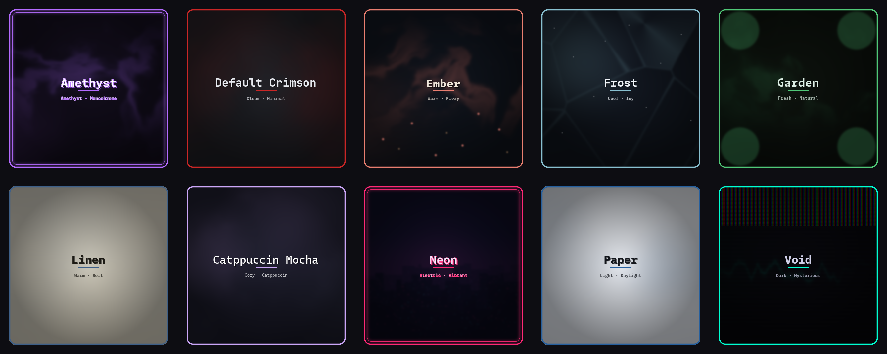

# Hyprland Workstation Environment (HWE)

**English** · [Русский](README.ru.md)

[](LICENSE)
[](https://archlinux.org)
[](https://hyprland.org)
[](../../releases/latest)
[](../../actions/workflows/ci.yml)

**A working environment on Arch — Hyprland and everything around it: bar, launcher,
notifications, themes, login screen.** It installs with one command and deploys the same
way on bare metal (`hwe install`) and on a disposable VM (`hwe vm up`), from one source.

The environment is described in full inside the repository and reproduces on any machine
from that description. Colours, geometry and fonts of every component are rendered from a
single palette file (`themes/<name>/theme.toml`) — the same mechanism that gives you
reproducibility keeps the whole stack in one tone.

- **Theme engine** — one `theme.toml` sets the colours of every component at once;
  `hwe theme apply` changes the desktop live. Ten themes included.
- **Modular Hyprland config** — hyprland, kitty, waybar, rofi, mako, hyprlock and
  hypridle wired together with `source` includes.
- **Dev VM in one command** — `hwe vm up` brings up an Arch VM through
  `libvirt`/`virt-install` (visible in virt-manager), provisions it with `cloud-init`
  and deploys your chosen local git branch straight from your own repository.

<p align="center">
  
  <br>
  <em>Ten built-in themes (eight dark + two light: <code>paper</code> and the softer <code>linen</code>) — each one is a single <code>theme.toml</code> the whole stack is rendered from.</em>
</p>

---

## Documentation

| Document | What is in it |
|---|---|
| [`themes/README.md`](themes/README.md) | writing a theme: the `[sem]` role contract, `[params]`, typography, wallpaper styles |
| [`CONTRIBUTING.md`](CONTRIBUTING.md) | development workflow, quality gates, tests, how colour flows through the repo |
| [`CHANGELOG.md`](CHANGELOG.md) | what changed in each version |
| [`LICENSE`](LICENSE) | GPL-3.0 |

Everything below is the tour: install it, run it, hack on it.

---

## Installation

Installing onto an Arch machine is one command: the installer adds packages, deploys the
configs and sets up the login screen. It does so **reversibly**, preserving whatever is
already on the machine.

```bash
# 1. Clone the repository
git clone https://github.com/valentinesowl/hyprwe.git ~/hwe
cd ~/hwe

# 2. Switch to a TTY (Ctrl+Alt+F2) and roll HWE out onto this machine.
#    The installer refuses to start from a graphical session: it touches the
#    compositor, the bar and the login shell — not something to do under a running Hyprland.
./bin/hwe install
```

What `hwe install` does:

- installs `pkg/core.lst` + `pkg/dev.lst` (official repos); `paru` is bootstrapped only if
  `pkg/aur.lst` is non-empty;
- symlinks `config/*` into `~/.config`, **keeping** your previous configs beside them as `*.hwe-bak`;
- generates and applies the default theme (`mocha`);
- makes `zsh` the login shell and enables NetworkManager + SDDM (the login screen).

**GPU.** Intel/AMD work out of the box — mesa comes along with Hyprland, the drivers are
in-tree, there is nothing to configure. **NVIDIA** is detected by the installer via `lspci`
and set up for you: driver (open modules for Turing+, proprietary for older cards),
DRM modesetting, initramfs modules and a pacman rebuild hook. That touches boot, so it asks
for confirmation — and, honestly: **this path has not yet been tried on live NVIDIA hardware**
(development happened on Intel). `HWE_NO_NVIDIA=1` skips it entirely; `HWE_NVIDIA_DRIVER=<package>`
pins the driver if the generation detection guessed wrong. `hwe uninstall` does **not** roll
that layer back (initramfs/modules).

Careful and predictable:

- **A system upgrade is opt-in.** `pacman -Su` runs only with `HWE_FULL_UPGRADE=1`; otherwise
  the install works against the current package database.
- **Opt-outs:** `HWE_NO_ZSH=1` (leave the shell alone), `HWE_NO_NM=1` (leave networking alone),
  `HWE_NO_NVIDIA=1` (leave the GPU alone), `HWE_FORCE=1` (run even from a graphical session — at your own risk).
- **Rollback:** `hwe uninstall` removes the symlinks and restores the shell from `*.hwe-bak`;
  packages and services stay in place — you cannot lock yourself out.

After the install `hwe` is linked into `/usr/local/bin/hwe` — from then on you just call
`hwe …` (before the install — `./bin/hwe …`). The first login greets you and points at
`SUPER + /`, the keybinding cheatsheet.

> Configs are deployed as **symlinks** into the repository: edit `~/hwe/config/...` and the
> change is live right away.

### Keeping a machine in sync

```bash
hwe update            # pull the repo and reconcile this machine
hwe update --check    # read-only: report drift, change nothing
hwe doctor            # same read-only check (bare doctor = doctor host)
hwe doctor vm         # host prerequisites for the VM workflow instead
```

`hwe update` pulls with `--ff-only` and stops if the tree is dirty or the history has
diverged — it will never silently merge or stash your work. Then it relinks the configs,
re-applies the current theme and offers to install packages that are missing from the
lists. `hwe doctor` reports the same drift without touching anything: config symlinks,
packages, login shell, Hyprland config errors. Detection and repair share the install
primitives, so a check cannot drift from what the installer actually lays down.

---

## CLI: `hwe`

| Command | What it does |
|---|---|
| `hwe install` | install packages and deploy configs onto **this** machine |
| `hwe update [--check]` | pull the repo and reconcile this machine (configs, theme, packages) |
| `hwe uninstall` | revert config symlinks and login shell (packages/services stay) |
| `hwe theme <list\|apply\|pick\|validate\|current\|sddm>` | render every component's colours from a theme |
| `hwe wall <list\|set\|random\|pick\|current\|restore>` | wallpaper (generated by the theme, or your own photos) |
| `hwe power` | rofi session menu (lock/logout/suspend/reboot/shutdown) |
| `hwe keys` | keybinding cheatsheet (rofi, generated from the binds; `SUPER+/`) |
| `hwe clip <show\|wipe>` | clipboard history (cliphist, rofi; `SUPER+C`) |
| `hwe record <toggle\|region>` | screen recording (wf-recorder → `~/Videos`; bar indicator) |
| `hwe checkconfig [--notify]` | show config errors from the running Hyprland |
| `hwe vm <up\|ssh\|console\|status\|list\|down\|destroy\|rebuild>` | the local dev VM (libvirt + cloud-init) |
| `hwe doctor [host\|vm]` | health-check this machine (host, the default) or the VM prerequisites |
| `hwe version` | print the version (from `bin/hwe`) |

---

## Themes

A theme is **one** file, `themes/<name>/theme.toml`: a private `[palette]` and the semantic
`[sem]` contract (~19 roles: `bg_*`, `fg_*`, `accent`, `red`/`green`/…, `border`, `urgent`).
The templates in `templates/*.j2` read **roles only**, so a new theme comes down to a single
`theme.toml`.

```bash
hwe theme list                # available themes (the current one is marked *)
hwe theme apply mocha         # render + deploy + live reload of every component
hwe theme pick                # rofi gallery with previews (SUPER+SHIFT+T)
hwe theme validate <name>     # check a theme against the contract (fail-loud)
```

The separate `[font]` table is a contract too: the font family and sizes for each surface
(`terminal`/`bar`/`launcher`/`notify`/`gtk`), with fallback defaults. Change the font size
right in the theme — see [`themes/README.md`](themes/README.md#typography-font).

`theme apply` renders colours into hyprland, waybar, kitty, rofi, mako, GTK 3/4, Kvantum
(Qt/KDE), starship, kdeglobals and hyprlock; then it makes the running applications reread
them and sets the theme's wallpaper. The SDDM greeter is synced separately (needs root):
`hwe theme sddm`.

**Themes included:** `amethyst` · `default` · `ember` · `frost` · `garden` · `mocha` (the
default) · `neon` · `paper` (light) · `linen` (soft light) · `void`. To add your own, see
[`themes/README.md`](themes/README.md).

### Wallpapers

```bash
hwe wall pick                 # rofi with thumbnails (SUPER+SHIFT+W)
hwe wall random [theme]       # a random wallpaper of the theme
hwe wall set <path|name>      # a specific file, or a name from `wall list`
```

Every theme carries a **generated** `wallpaper.png` (our own, no licences attached):
procedural art in one of six styles — see `themes/README.md`. Put your own photos into
`themes/<name>/wallpapers/` (it is in `.gitignore`) and they show up next to it.

---

## The Hyprland config

The entry point is `config/hypr/hyprland.conf`, which does nothing but pull in the modules:

| File | What it covers |
|---|---|
| `colors.conf` | **generated** by `hwe theme` (`$accent`, …) |
| `environment.conf` | session env + `$mainMod`, `$terminal`, `$launcher` |
| `monitors.conf` | monitors and scaling |
| `appearance.conf` | general / decoration / blur / animations |
| `theme.conf` | **generated** — border, rounding, opacity from the theme |
| `input.conf` | keyboard (us/ru), touchpad, gestures |
| `keybindings.conf` | keybinds (SUPER; focus on the arrows; no duplicates) |
| `windowrules.conf` | window and layer rules |
| `autostart.conf` | autostart (waybar, mako, hyprpaper, polkit, tray…) |

Plus `hypridle.conf` (idle → lock/DPMS) and `hyprlock.conf` (generated). On every login
`hwe checkconfig --notify` puts syntax errors on screen, should Hyprland change its grammar.

**The main binds:**
`SUPER+T` terminal · `SUPER+N` files · `SUPER+B` browser · `SUPER+R` launcher (rofi) ·
`SUPER+Q` close · `SUPER+V` floating · `SUPER+F` fullscreen · `SUPER+←↑↓→` focus ·
`SUPER+SHIFT+←↑↓→` move the window · `SUPER+1..0` workspaces · `SUPER+S` scratchpad ·
`SUPER+L` / `SUPER+Escape` lock · `SUPER+Space` us↔ru layout ·
`SUPER+SHIFT+T` theme · `SUPER+SHIFT+W` wallpaper · `SUPER+SHIFT+E` power menu ·
`SUPER+/` bind cheatsheet · `SUPER+C` clipboard · `SUPER+SHIFT+C` colour picker ·
`SUPER+ALT+R` / `SUPER+ALT+S` screen recording (whole / region) ·
`Print` screenshot → clipboard · `SHIFT+Print` region → clipboard ·
`SUPER+Print` region → `~/Pictures` ·
`SUPER+SHIFT+Print` / `SUPER+P` region with annotation (satty) → `~/Pictures`.

---

## Sandbox and development (VM)

Want to try HWE on a separate, disposable machine — or to develop HWE itself? `hwe vm up`
brings up a **disposable** Arch VM (visible in virt-manager) and deploys **your local git
branch** into it, straight from your own repository. Inside, the very same `hwe install`
runs as on bare metal, so it is an honest rehearsal of the installation.

```bash
# 0. Check the host (libvirtd, groups, network, KVM)
./bin/hwe doctor vm

# 1. Bring up a VM with the current branch (or name one)
./bin/hwe vm up
./bin/hwe vm up feature-x

# 1b. Or deploy the working tree as it is, before committing anything
./bin/hwe vm up --uncommitted

# 2. Get inside (once cloud-init has finished)
./bin/hwe vm ssh
./bin/hwe vm console      # or watch it boot in virt-manager
./bin/hwe vm status       # state + IP

# 3. Rebuild from scratch / tear down
./bin/hwe vm rebuild
./bin/hwe vm destroy
```

By default the VM gets the branch's last commit. `--uncommitted` deploys the working tree
instead — modified, staged, deleted and new files included — so a change can be tested
before it is committed. The snapshot is built through a separate index and a temporary
`--shared` clone: your index, working tree and branches do not move, and no commit appears
in your history. Ignored files stay behind; the guest regenerates them.

Logging into the VM: user **`hwe`**, password **printed by `vm up`** (random, per build).
Your `~/.ssh/id_*.pub` keys are passed into the guest automatically — normally you log in
by key, and the password is left for the console only.

Configs inside the VM are deployed as **symlinks** into the repository, so edits in
`~/hwe/config/...` are visible immediately — handy when developing HWE itself.

### How it works

1. `hwe vm up <branch>` downloads the Arch cloud image into `~/.cache/hwe/` (once) and
   **verifies its GPG signature** against the pinned arch-boxes fingerprint.
2. It makes a `git bundle` of the chosen branch — or, with `--uncommitted`, of a throwaway
   snapshot of your working tree — and puts it on a **NoCloud seed ISO** (`xorriso`).
3. `virt-install --import` creates a **libvirt domain** (visible in virt-manager).
4. `cloud-init` in the guest creates the user, mounts the seed, does a `git clone` from the
   bundle and runs `hwe install` — the machine brings itself up, from image to finished desktop.

### Overrides (env)

| Variable | Default | Purpose |
|---|---|---|
| `HWE_VM_NAME` | `hwe-dev` | libvirt domain name |
| `HWE_VM_MEMORY` | `4096` | RAM, MiB |
| `HWE_VM_VCPUS` | `4` | vCPUs |
| `HWE_VM_DISK_SIZE` | `24G` | root disk size |
| `HWE_VM_USER` | `hwe` | user name in the guest |
| `HWE_VM_PASSWORD` | *random* | password (set it to pin one) |
| `HWE_LIBVIRT_URI` | `qemu:///system` | libvirt URI (the virt-manager default) |
| `HWE_VM_NETWORK` | `default` | libvirt network name |
| `HWE_IMAGE_URL` | Arch cloudimg | base qcow2 |

---

## Repository layout

```
hyprwe/
├── bin/hwe                 # the one CLI: vm · install · update · theme · wall · power · keys · clip · record · checkconfig · doctor
├── lib/
│   ├── common.sh           # logging, confirm, need, run
│   ├── vm.sh               # virt-install + cloud-init + git bundle
│   ├── theme.sh            # hwe theme — render the palette into every component
│   ├── wall.sh             # hwe wall — wallpaper (per theme, live swap)
│   ├── update.sh           # hwe update — ff-only pull + reconcile the machine
│   ├── doctor.sh           # hwe doctor — drift check for the machine (and the VM host)
│   ├── power.sh            # hwe power — rofi session menu
│   ├── keys.sh             # hwe keys — bind cheatsheet (rofi)
│   ├── clip.sh             # hwe clip — clipboard history (cliphist)
│   ├── record.sh           # hwe record — screen recording (wf-recorder)
│   ├── checkconfig.sh      # hwe checkconfig — Hyprland config errors
│   └── welcome.sh          # hwe welcome — greeting on the first login
├── provision/
│   ├── cloud-init/         # user-data.tmpl, meta-data.tmpl (@@VAR@@ tokens)
│   ├── guest-install.sh    # installs packages + deploys configs (guest and bare metal alike)
│   ├── sddm/hwe/           # the SDDM QML greeter (themed from the active palette)
│   ├── hyprland-uwsm.desktop  # the Hyprland (uwsm) session for SDDM
│   └── arch-boxes.asc      # pinned signing key of the cloud image
├── pkg/                    # core.lst · dev.lst · vm.lst · aur.lst
├── themes/<name>/          # theme.toml (palette + [sem]) + wallpaper.png + preview.png
├── templates/              # .j2 — every component's colours are rendered from [sem]
├── config/                 # XDG configs → symlinked into ~/.config
│   ├── hypr/               # the modular Hyprland (see hyprland.conf)
│   ├── waybar/ rofi/ mako/ kitty/ gtk-3.0/ gtk-4.0/ zsh/
│   └── starship.toml
├── scripts/                # render-theme.py · genwall.py · genpreview.py · wbstat.py
├── tests/                  # pytest (theme engine, generators, repo hygiene) + bats/ (bash)
├── .github/workflows/      # ci.yml (PR gates) · release.yml (tag vX.Y.Z → release)
├── CHANGELOG.md            # the version lives in bin/hwe; tag and CHANGELOG are cross-checked in CI
└── justfile                # dev tasks (just up / ssh / check / walls …)
```

## Development

```bash
just            # list the tasks
just up         # = hwe vm up
just check      # everything CI checks: linters + tests (see CONTRIBUTING.md)
just test       # tests only: pytest + bats
just lint       # shellcheck over every script
just fmt        # shfmt (4 spaces; not a gate)
just walls      # regenerate the wallpapers of every theme
just previews   # regenerate the theme previews (for the rofi gallery)
just gallery    # rebuild assets/themes.png from the previews
```

The quality gates are installed along with everything else by `hwe install` (`pkg/dev.lst`),
and CI installs exactly the same ones — so a green `just check` locally means a green
pipeline. How to contribute — [CONTRIBUTING.md](CONTRIBUTING.md).

---

## Status

`v1.1.0` — the lifecycle release: `hwe update`, `hwe doctor host` and
`hwe vm up --uncommitted` on top of the stable 1.0.0 base (the VM workflow, the
installer, the theme engine with 10 themes, the SDDM greeter, zsh). Next: more bar
components, more workflows, polish.

## Acknowledgements

Inspired by the author's own system for AwesomeWM and by
[HyDE](https://github.com/HyDE-Project/HyDE) — thank you for the ideas.

## License

[GPL-3.0](LICENSE) © 2026 valentinesowl.

The wallpapers and theme previews (`themes/*/wallpaper.png`, `themes/*/preview.png`) are
generated by the repository's own scripts and ship under the same license. Personal photos
in `themes/*/wallpapers/` stay local (see `.gitignore`).
